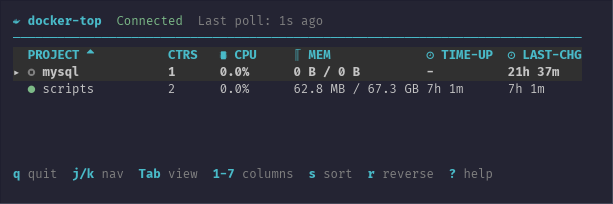

# docker-top

A TUI for monitoring Docker Compose projects.



## Features

- **Project Discovery**: Automatically detects all Docker Compose projects running on your system
- **Table View**: Displays projects with aggregated metrics including CPU, memory, network I/O, and container count
- **Chart View**: Visual representation of project resource utilization
- **Flexible Sorting**: Sort projects by name, container count, CPU, memory, network activity, disk I/O, uptime, and last change
- **Configurable Columns**: Toggle visibility of columns 1-7 to customize your view
- **Real-time Metrics**: Continuously polls Docker daemon for up-to-date container statistics
- **Status Indicators**: Shows whether projects are running, partial, stopped, or in a dead state
- **Uptime Tracking**: Displays how long projects have been running and when they were last modified

## Installation

### Homebrew

```bash
brew tap Fuabioo/tap
brew install docker-top
```

### Cargo

```bash
cargo install docker-top
```

### Binary Download

Download the archive for your platform from [GitHub releases](https://github.com/Fuabioo/docker-top/releases), extract it, and place `docker-top` in your `$PATH`.

## Usage

Simply run:

```bash
docker-top
```

The application auto-discovers Docker Compose projects from your Docker daemon. No configuration needed.

## Keybindings

| Key | Action |
|-----|--------|
| `q` / `Ctrl+C` | Quit |
| `j` / `Down` | Next row |
| `k` / `Up` | Previous row |
| `g` | Jump to top |
| `G` | Jump to bottom |
| `Tab` | Toggle Table / Chart view |
| `1-7` | Toggle columns |
| `s` | Cycle sort column forward |
| `S` | Cycle sort column backward |
| `r` | Reverse sort direction |
| `?` | Toggle help overlay |

## Requirements

- Docker daemon running and accessible
- Terminal with Nerd Font support for proper icon rendering

## License

MIT
